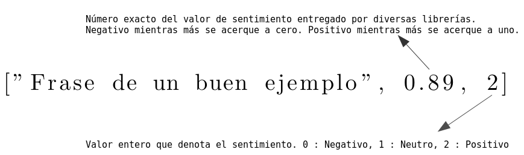

# Conjuntos de datos etiquetados en Español

Bajo la carpeta sentiment-analysis se encuentra un conjunto de frases etiquetadas con su valor de sentimiento.
Los datos fueron obtenidos desde obras literarias en español (desde: http://www.gutenberg.org/) cuyos derechos de copia han caducado. También desde noticias escritas abiertas al público.

Un formato de los ejemplos se denota en seguida:

